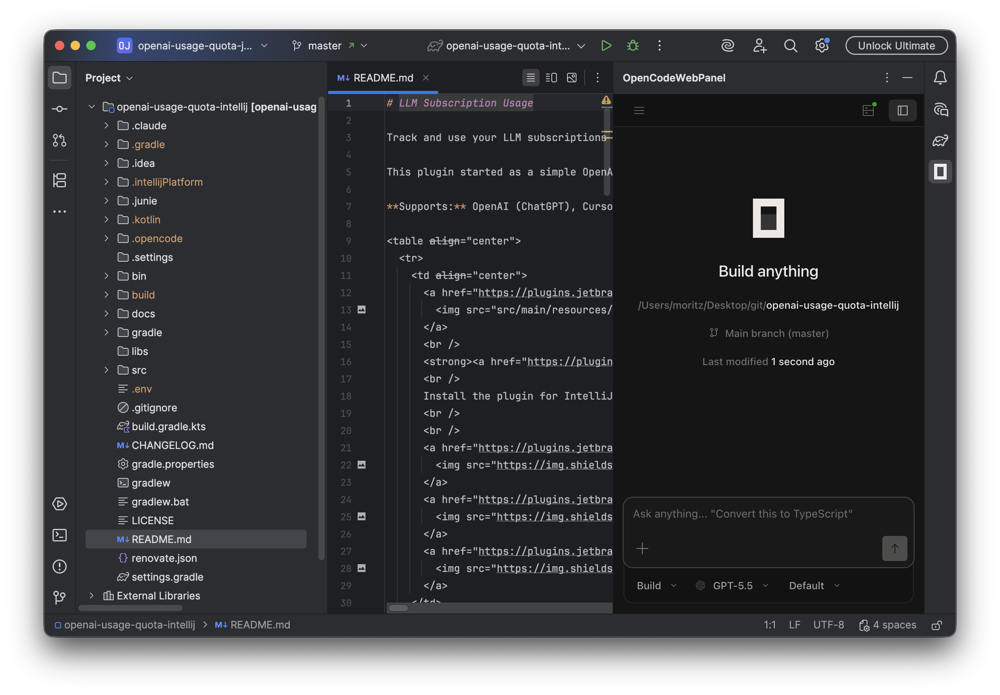

# OpenCode Web Panel

<table align="center">
  <tr>
    <td align="center">
      <a href="https://plugins.jetbrains.com/plugin/32384">
        
      </a>
      <br />
      <strong><a href="https://plugins.jetbrains.com/plugin/32384">OpenCode Web Panel on JetBrains Marketplace</a></strong>
      <br />
      Embed OpenCode inside JetBrains IDEs.
      <br />
      <br />
      <a href="https://plugins.jetbrains.com/plugin/32384">
        
      </a>
      <a href="https://plugins.jetbrains.com/plugin/32384">
        
      </a>
      <a href="https://plugins.jetbrains.com/plugin/32384">
        
      </a>
      <a href="https://github.com/moritzfl/intellij-opencode-web-panel/releases/latest">
        
      </a>
    </td>
  </tr>
</table>



<!-- Plugin description -->

OpenCode Web Panel brings the official OpenCode web UI into JetBrains IDEs. It opens OpenCode in a right-side tool window, keeps it focused on the project you are working on, and adds small IDE conveniences on top of the normal OpenCode experience.

> **Note:** This is an unofficial community plugin for OpenCode and is not affiliated with OpenCode.

### Why use it

- **OpenCode where you code** - Use OpenCode beside your editor instead of switching to the terminal, desktop app, or standalone web app.
- **Official web UI** - The embedded panel loads OpenCode's own web app, so the core experience stays familiar.
- **Project-aware sessions** - OpenCode starts on the directory configured for the current IDE project.
- **IDE file navigation** - Click local file links and code references from chat to open them in the IDE.
- **Chat file drop and paste** - Drag or paste project files into chat as `@relative/path` references, or attach dropped files.
- **External links stay outside** - HTTP links open in your system browser instead of taking over the panel.
- **IDE notifications** - OpenCode browser notifications can appear as JetBrains IDE notifications.
- **Panel controls in the title bar** - Zoom the panel and restart the OpenCode server directly from the tool window.
- **Recovery built in** - Failed or crashed servers surface a clear error panel with recent logs, retry, and settings shortcuts, and the panel recovers automatically where possible.
- **Configurable safeguards** - Browser-side convenience features can be disabled if an OpenCode update conflicts with them.

<!-- Plugin description end -->

## Requirements

- A JetBrains IDE compatible with this plugin.
- The OpenCode CLI installed on your machine.
- The `opencode` command available on `PATH`, or configured manually in the plugin settings.

## Installation

- Install from the IDE plugin marketplace:

  <kbd>Settings/Preferences</kbd> > <kbd>Plugins</kbd> > <kbd>Marketplace</kbd> > <kbd>Search "OpenCode Web Panel"</kbd> > <kbd>Install</kbd>

- Install from JetBrains Marketplace:

  Visit [OpenCode Web Panel on JetBrains Marketplace](https://plugins.jetbrains.com/plugin/32384) and install the plugin.

- Install manually:

  Download the [latest release](https://github.com/moritzfl/intellij-opencode-web-panel/releases/latest), then install it with <kbd>Settings/Preferences</kbd> > <kbd>Plugins</kbd> > <kbd>Settings</kbd> > <kbd>Install Plugin from Disk...</kbd>

## Getting Started

1. Install the OpenCode CLI.
2. Open a project in your JetBrains IDE.
3. Click the **OpenCode Web Panel** tool window on the right sidebar.
4. Start using OpenCode in the embedded panel.

The plugin starts a local OpenCode server when needed, authenticates the embedded web UI automatically, and opens the configured project directory.

## Tool Window Controls

The tool window title bar offers quick controls (also available in the tool window's gear menu on narrow panels):

- **Zoom out / Zoom in** - Scale the embedded OpenCode UI in 10% steps without reloading.
- **Restart Server** - Stop and restart the shared OpenCode server. Asks for confirmation while the server is running, since a restart interrupts OpenCode work in all open projects.
- The gear menu additionally offers **Reset Zoom**, **View Server Log**, and **OpenCode Web Panel Settings**.

## Settings

Open <kbd>Settings/Preferences</kbd> > <kbd>Tools</kbd> > <kbd>OpenCode Web Panel</kbd>.

### OpenCode Server Setup

- Choose whether the plugin should auto-detect `opencode` or use a custom executable path.
- Let OpenCode select a port automatically, or set a fixed port.
- Edit, generate, show, or copy the local server password stored in IntelliJ Password Safe.
- Restart the local OpenCode server.
- View recent OpenCode server output in your system text viewer.

### OpenCode UI Settings

- Restore the most recent OpenCode conversation for the project on startup.
- Open local file links in the IDE.
- Open external HTTP links in the system browser.
- Enable click-to-navigate for code references in chat.
- Enable file drop and paste into chat, using `@relative/path` for project file references.
- Lock OpenCode to compact layout for panel-friendly use.
- Sync OpenCode's system color scheme with the IDE theme.
- Suppress project-switch prompts that are not useful inside the embedded panel.
- Forward OpenCode browser notifications to the IDE.
- Wait briefly for IntelliJ MCP server readiness before launching OpenCode.

### Project Settings

Project-specific settings are stored with the IDE project.

- Use **Auto detect** to open the IDE project root in OpenCode.
- Use **Custom Directory** to point OpenCode at another directory, such as a monorepo root or a subproject.
- Use **Detect** to fill the custom directory with the auto-detected project root.

## Troubleshooting

**OpenCode does not start**

- Check that the OpenCode CLI is installed.
- Run `opencode --version` in a terminal.
- The panel shows an error view with recent server output plus **Retry**, **Open Settings**, and **View Full Log** actions.
- Open the plugin settings and use **Detect** or set the OpenCode executable path manually.

**The panel shows a failed server state**

- Click **Retry** in the tool-window status strip or on the error view.
- If it still fails, review the server output shown on the error view.
- Verify the configured OpenCode project directory exists.

**The embedded UI behaves unexpectedly after an OpenCode update**

- Disable the affected convenience feature under **OpenCode UI Settings**.
- Reload or reopen the tool window.
- Report the issue with the OpenCode version and plugin version.

## Development

Useful development commands:

```bash
./gradlew test
./gradlew runIde
./gradlew runIdeForUiTests
```

- `test` runs JVM and IntelliJ Platform tests.
- `runIde` launches a sandbox IDE with the plugin installed.
- `runIdeForUiTests` launches the sandbox IDE with the JetBrains Robot Server enabled.

Repository: https://github.com/moritzfl/intellij-opencode-web-panel

## Acknowledgements

This project started as a fork of an early draft by xausky: https://github.com/xausky/intellij-opencode-web-ui/

## License

This project is licensed under the MIT License.

## Disclaimer

This plugin is an unofficial community plugin for OpenCode and is not affiliated with OpenCode. Please report plugin issues through GitHub Issues.

---

If you find this plugin useful, please consider giving it a star.
