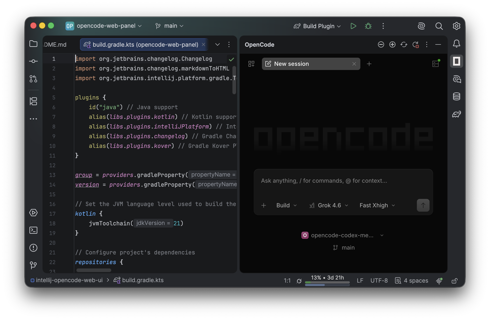

# OpenCode Web Panel

<table align="center">
  <tr>
    <td align="center">
      <a href="https://plugins.jetbrains.com/plugin/32384">
        
      </a>
      <br />
      <strong><a href="https://plugins.jetbrains.com/plugin/32384">OpenCode Web Panel on JetBrains Marketplace</a></strong>
      <br />
      Embed OpenCode inside JetBrains IDEs.
      <br />
      <br />
      <a href="https://plugins.jetbrains.com/plugin/32384">
        
      </a>
      <a href="https://plugins.jetbrains.com/plugin/32384">
        
      </a>
      <a href="https://plugins.jetbrains.com/plugin/32384">
        
      </a>
    </td>
  </tr>
</table>



<!-- Plugin description -->

OpenCode Web Panel brings the official OpenCode web UI into JetBrains IDEs. Use it in a right-side tool window or move the live panel into an editor tab. It stays focused on the project you are working on and adds small IDE conveniences on top of the normal OpenCode experience. Host CLI and Docker Sandbox work with **OpenCode 1.18** and **CLI 2.x**.

> **Note:** This is an unofficial community plugin for OpenCode and is not affiliated with OpenCode.

### Why use it

- **OpenCode where you code** - Use OpenCode beside your editor instead of switching to the terminal, desktop app, or standalone web app.
- **Official web UI** - The embedded panel loads OpenCode's own web app, so the core experience stays familiar.
- **Project-aware sessions** - OpenCode starts on the directory configured for the current IDE project.
- **Optional Docker Sandboxes** - Run OpenCode inside a per-project Docker Sandbox (`sbx`) instead of a host `opencode serve`. Native CLI remains the default.
- **IDE file navigation** - Click local file links and code references from chat to open them in the IDE.
- **Chat file drop and paste** - Drag or paste project files into chat as `@relative/path` references, or attach dropped files.
- **Send code to chat** - Add files or the current selection to the OpenCode chat from the editor and project view context menus.
- **External links stay outside** - HTTP links open in your system browser instead of taking over the panel.
- **IDE notifications** - OpenCode browser notifications can appear as JetBrains IDE notifications, including Allow/Deny actions for agent permission requests.
- **Agent status at a glance** - The tool window icon shows when the agent is working or waiting for your input.
- **Tool window or editor tab** - Move the same live panel between hosts without reloading or losing an unsent draft. Zoom, restart, and other controls are available in both.
- **Recovery built in** - Failed or crashed servers surface a clear error panel with recent logs, retry, and settings shortcuts, and the panel recovers automatically where possible.
- **Configurable safeguards** - Browser-side convenience features can be disabled if an OpenCode update conflicts with them.

<!-- Plugin description end -->

## Requirements

- A JetBrains IDE compatible with this plugin.
- The OpenCode CLI installed on your machine (Host runtime, the default): **1.18** or **CLI 2.x**.
- The `opencode` command available on `PATH`, or configured manually in the plugin settings.
- Optional: Docker Sandboxes (`sbx`) and a Docker account when **Runtime** is set to Docker Sandbox.

## Installation

- Install from the IDE plugin marketplace:

  <kbd>Settings/Preferences</kbd> > <kbd>Plugins</kbd> > <kbd>Marketplace</kbd> > <kbd>Search "OpenCode Web Panel"</kbd> > <kbd>Install</kbd>

- Install from JetBrains Marketplace:

  Visit [OpenCode Web Panel on JetBrains Marketplace](https://plugins.jetbrains.com/plugin/32384) and install the plugin.

- Install manually:

  Download the [latest version from JetBrains Marketplace](https://plugins.jetbrains.com/plugin/32384/versions), then install it with <kbd>Settings/Preferences</kbd> > <kbd>Plugins</kbd> > <kbd>Settings</kbd> > <kbd>Install Plugin from Disk...</kbd>

## Getting Started

1. Install the OpenCode CLI.
2. Open a project in your JetBrains IDE.
3. Click the **OpenCode Web Panel** tool window on the right sidebar.
4. Start using OpenCode in the embedded panel.

The plugin starts a local OpenCode server when needed, authenticates the embedded web UI automatically, and opens the configured project directory.

## Panel Controls

The tool window title bar and editor toolbar offer quick controls (also available in their gear menus on narrow panels):

- **Zoom out / Zoom in** - Scale the embedded OpenCode UI in 10% steps without reloading. Cmd/Ctrl with <kbd>+</kbd>, <kbd>-</kbd>, and <kbd>0</kbd> work inside the panel too.
- **Reload Page** - Reload the embedded OpenCode UI. The server stays running.
- **Move to Editor / Move to Tool Window** - Move the live panel without reloading. The current session, draft, and browser state stay intact.
- **Restart Server** - Stop and restart this project's OpenCode server, and recreate the embedded browser in its current host. Recovers a stuck or crashed panel. Also on **OpenCode Web Panel (Project)**.
- The gear menu additionally offers **Reset Zoom**, **View Server Log**, and **OpenCode Web Panel Settings**.

### OpenCode in the Editor

Choose **Move to Editor** from the panel title bar or gear menu. The editor tab can move between splits and IDE windows like other tabs; each project keeps one live OpenCode panel. Closing the tab returns that panel to the tool window without stopping the server. Choose **Move to Tool Window** to return and show it immediately.

Use **Find Action → Move OpenCode Panel** to toggle between the two hosts. To assign a keyboard shortcut, open **Settings/Preferences → Keymap** and search for **Move OpenCode Panel**. No shortcut is assigned by default.

While the panel is in an editor, reopening the tool window offers **Show in Editor** and **Move to Tool Window**. Chat context actions and **Show in OpenCode** notifications activate the current host.

### Context Menu Actions

- **Add to OpenCode Chat** (project view, editor tabs) - Insert `@path` references for the selected project files into the chat.
- **Add Selection to OpenCode Chat** (editor) - Insert the file reference plus the selected lines as a code snippet.

Both actions activate the panel wherever it is currently placed and deliver the input once OpenCode has finished loading. They follow the **Enable file drop and paste into chat** setting.

## Settings

Open <kbd>Settings/Preferences</kbd> > <kbd>Tools</kbd> > <kbd>OpenCode Web Panel</kbd>.

### OpenCode Server Setup

- Per project (**OpenCode Web Panel (Project)**): **Runtime** Host or Docker Sandbox, this project's server status/restart/log/port, plus mounts and kits. Stored in `opencode-sbx/opencode-sbx.yaml` (source of truth; the panel hydrates from it). Apply also writes `opencode-sbx/opencode-sbx.sh` so a teammate can run `./opencode-sbx/opencode-sbx.sh` (web), `./opencode-sbx/opencode-sbx.sh --cli` (TUI), or `./opencode-sbx/opencode-sbx.sh --acp` (ACP stdio) without the plugin. On Windows, run the `.sh` from Git Bash.
- Application settings: Host CLI binary, password, HTTP proxy, `sbx` path, and network-policy consent.
- **Share host OpenCode config (read-only)** mounts the host config directory, including JSON/JSONC, skills, agents, commands, and plugins. The sandbox can read any credentials embedded in those files, but cannot change them. Host `auth.json` and the host credential database are not shared. Sandbox sessions and browser preferences remain separate.
- Provider authentication is independent of IntelliJ: use Docker's `sbx secret` for API keys or sign in separately through OpenCode inside the sandbox. The plugin and standalone launcher never copy host OpenCode credentials or run an OAuth proxy. See [Sandbox credentials and standalone use](#sandbox-credentials-and-standalone-use).
- **Check sandbox setup** on the project settings page checks guest access to `opencode.ai`, `registry.npmjs.org` (2.x installation), and `models.opencode.ai` (model catalog). It uses saved settings and an owned, running VM. A healthy local server does not prove provider authentication or these outbound connections work.
- Selecting **OpenCode 2.x** validates the guest binary's actual version before launch and after installation or upgrade. A missing binary is installed; an existing wrong-major, corrupt, or hung binary reports a validation failure. Reinstall OpenCode 2.x inside the sandbox, then retry. The launcher follows the same validation rules.
- **OpenCode version** is stored per project as `openCodeVersion: 1.x` or `2.x` (default `1.x`). Switching restarts OpenCode and keeps the VM. 1.x uses the kit binary even when 2.x is installed. New 2.x sandboxes keep their binary in a separate plugin-owned host directory until Reset Sandbox. Existing 1.x VMs switched to 2.x keep it inside the VM; Reset applies the host mount. Select 2.x before the first start when sharing a V2 host configuration.
- Apply/start writes one shell launcher, `opencode-sbx.sh`, with installation and version validation built in. The IDE and launcher share those checks and leave provider/model configuration to OpenCode. Apply/start removes the older helper scripts and provider-compatibility JSON.
- **Protect sandbox files** overlays the `opencode-sbx/` folder (spec, launchers, extra-network kit) and other local kit directories read-only on top of the writable project mount (on by default). Reset the sandbox to apply to an existing VM.
- **Persist sandbox sessions across Reset** keeps this sandbox's OpenCode data, including conversations and sandbox-owned logins, on the host in a plugin data directory (not Host CLI's `opencode.db`). Reset recreates the VM and remounts the same store.
- Choose whether the plugin should auto-detect `opencode` or use a custom executable path.
- Per project, let OpenCode select a port automatically, or set a fixed port. Host CLI binds that loopback port; Docker Sandbox republishes VM 4096 to it without recreating the sandbox.
- Edit, generate, show, or copy the local server password stored in IntelliJ Password Safe.
- Choose how the OpenCode server reaches the network: the IDE HTTP Proxy, environment
  variables, or no proxy.
- Restart this project's OpenCode server from the tool window or **OpenCode Web Panel (Project)**.
- View recent OpenCode server output from **OpenCode Web Panel (Project)**.
- An optional lightning-bolt action indicates a newer same-major OpenCode release. Click it to upgrade this project's sandbox or view a copyable Host CLI upgrade command. Disable it in application settings.

### Sandbox credentials and standalone use

The sandbox can run without IntelliJ or this plugin. Docker Sandboxes owns its
credential proxy; OpenCode owns accounts created inside the sandbox.

1. Keep the generated `opencode-sbx/` directory with the project, including the
   YAML, launcher, and any network kit. Install Docker Sandboxes and set up
   its network policy on each machine. Use `sbx ls` to find the local sandbox name.
2. For an API key, run `sbx secret set openai --sandbox <name>` in a terminal and
   enter the key at its prompt. Replace `openai` with a supported service such as
   `anthropic`, `mistral`, or `xai`. Sandbox-scoped changes apply immediately.
   Global secrets (`sbx secret set openai`) apply when a sandbox is created.
3. For an independent OpenCode 2 account, launch
   `./opencode-sbx/opencode-sbx.sh --cli`, enter `/connect`, and select the provider
   and authentication method. ChatGPT **headless** and SuperGrok **device** login
   avoid callbacks to a port inside the VM. Alternatively, run
   `./opencode-sbx/opencode-sbx.sh --cli --oc-args auth login`.
   Complete sign-in yourself in the browser. Do not combine this with an `sbx`
   secret for the same provider: Docker's proxy can replace the account's header.
   With `sbx` 0.39.0, removing a secret did not clear its injected value even
   after a VM Stop/Start. Remove the secret and recreate the sandbox when
   switching from native key injection to a sandbox-owned account; keep
   **Persist sandbox sessions across Reset** enabled to retain OpenCode data.
4. Stop the IDE-managed server before handing ownership to the launcher. Run
   `./opencode-sbx/opencode-sbx.sh --web` to use the browser, `--cli` for the TUI,
   or `--acp` for another editor. Export `OPENCODE_SERVER_PASSWORD` yourself if
   you want web authentication; the launcher does not read IntelliJ Password Safe.
   Reuse the same project, sandbox, and persisted data to continue conversations.

Network permission is separate from credentials. OpenCode 2 installation needs
`opencode.ai` and `registry.npmjs.org`; the model catalog needs
`models.opencode.ai`. Subscription login additionally needs `auth.openai.com`
and `chatgpt.com` (ChatGPT), or `auth.x.ai` and `api.x.ai` (SuperGrok).
Allow required hosts using an extra-network kit or an explicit
`sbx policy allow network --sandbox <name> <host>`. Docker's balanced policy does
not include xAI. The browser opens the provider's own authorization page.

Docker documents `sbx secret set openai --oauth` for Codex; this plugin does not
assume it also authenticates OpenCode.

Existing installations that relied on automatic host authentication need to set
up sandbox credentials once. Previously copied accounts can remain in persisted
sandbox data; manage them with OpenCode's `/connect` or `auth logout`, rather than
editing either credential database. Closing or uninstalling the plugin does not
delete the generated launcher, sandbox, or persisted data. IntelliJ MCP tools
remain available only while the IDE is running.

See [Docker credentials](https://docs.docker.com/ai/sandboxes/security/credentials/)
and [OpenCode provider accounts](https://opencode.ai/v2/docs/cli/providers).

### OpenCode UI Settings

- Open local file links in the IDE.
- Open external HTTP links in the system browser.
- Enable click-to-navigate for code references in chat.
- Enable file drop and paste into chat, using `@relative/path` for project file references.
- Lock OpenCode to compact layout for panel-friendly use, with a full-width Home session list in OpenCode 2.x.
- Hide OpenCode's floating website/help button in the panel.
- Sync OpenCode's system color scheme with the IDE theme.
- Suppress project-switch prompts that are not useful inside the embedded panel.
- Forward OpenCode browser notifications to the IDE, optionally with Allow/Deny actions for permission requests.
- Show agent status on the tool window icon.
- Wait briefly for IntelliJ MCP server readiness before launching OpenCode.

### Project Settings

Project-specific settings are stored with the IDE project.

- Use **Auto detect** to open the IDE project root in OpenCode.
- Use **Custom Directory** to point OpenCode at another directory, such as a monorepo root or a subproject.
- Use **Detect** to fill the custom directory with the auto-detected project root.

## Troubleshooting

**OpenCode does not start**

- Check that the OpenCode CLI is installed.
- Run `opencode --version` in a terminal.
- The panel shows an error view with recent server output plus **Retry**, **Open Settings**, and **View Full Log** actions.
- Open the plugin settings and use **Detect** or set the OpenCode executable path manually.

**The panel shows a failed server state**

- Click **Retry** in the tool-window status strip or on the error view.
- If it still fails, review the server output shown on the error view.
- With a fixed port, the error view detects port conflicts and offers **Use Automatic Port**.
- Verify the configured OpenCode project directory exists.

**Provider API calls fail behind a proxy**

- Open <kbd>Settings</kbd> > <kbd>Tools</kbd> > <kbd>OpenCode Web Panel</kbd> and set **HTTP Proxy**.
- **Use IDE HTTP Proxy** forwards the IDE proxy
  (<kbd>Settings</kbd> > <kbd>Appearance & Behavior</kbd> > <kbd>System Settings</kbd> > <kbd>HTTP Proxy</kbd>),
  including auto-detect and PAC. PAC is resolved for a generic HTTPS target, because OpenCode
  accepts only a single `HTTP_PROXY` value.
- **Use environment variables** keeps `HTTP_PROXY` / `HTTPS_PROXY` from the environment the IDE was started with.
- **No proxy** removes proxy variables from the OpenCode process.
- Restart the OpenCode server after changing proxy settings.

**The panel is stuck, blank, or frozen on “Opening the OpenCode page…”**

- Use **Restart Server** in the tool window title bar, gear menu, or **OpenCode Web Panel (Project)** settings. Host CLI and Docker Sandbox restarts are this project only.
- **Reload Page** reloads the UI without restarting the server; use Restart if that is not enough.

**The embedded UI behaves unexpectedly after an OpenCode update**

- Disable the affected convenience feature under **OpenCode UI Settings**.
- Reload or reopen the tool window.
- Report the issue with the OpenCode version and plugin version.

## Development

Useful development commands:

```bash
./gradlew test
./gradlew runIde
./gradlew runIdeForUiTests
```

- `test` runs JVM and IntelliJ Platform tests.
- `runIde` launches a sandbox IDE with the plugin installed.
- `runIdeForUiTests` launches the sandbox IDE with the JetBrains Robot Server enabled.

Repository: https://github.com/moritzfl/intellij-opencode-web-panel

## Acknowledgements

This project started as a fork of an early draft by xausky: https://github.com/xausky/intellij-opencode-web-ui/

## License

This project is licensed under the MIT License.

## Disclaimer

This plugin is an unofficial community plugin for OpenCode and is not affiliated with OpenCode. Please report plugin issues through GitHub Issues.

---

If you find this plugin useful, please consider giving it a star.
